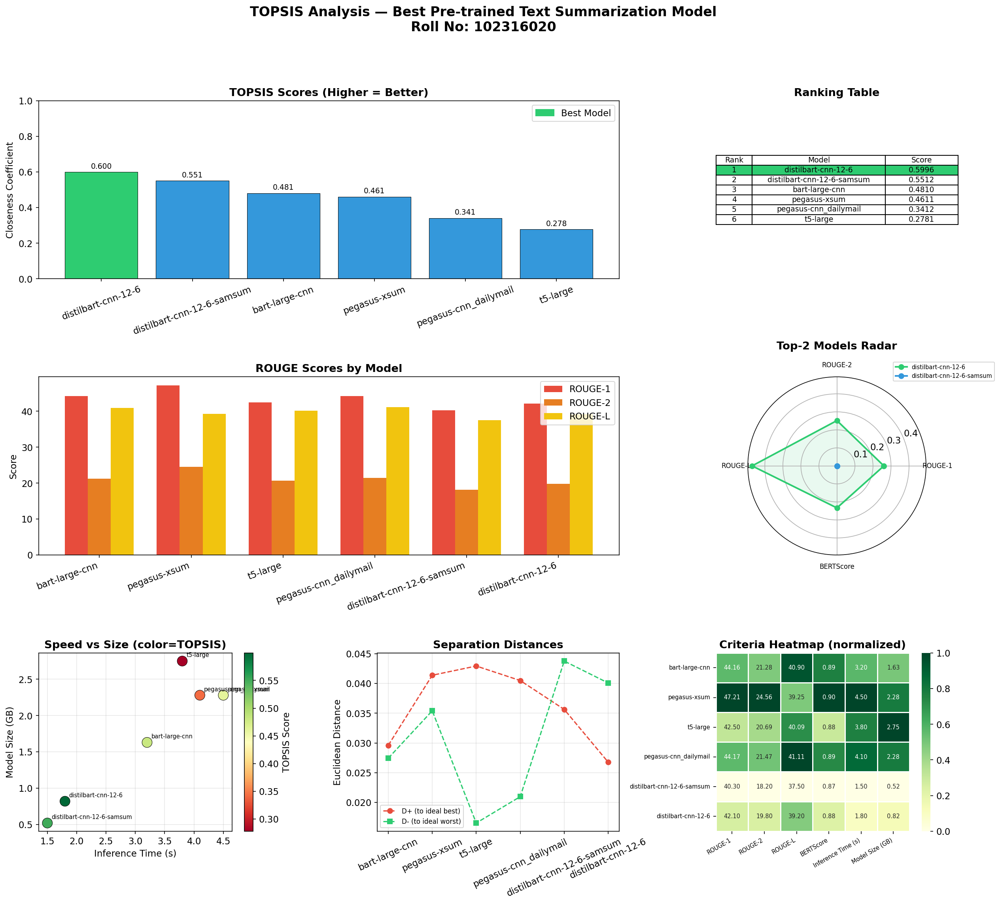

# TOPSIS Analysis - Best Pre-trained Text Summarization Model

**Roll Number:** 102316020  
**Task:** Text Summarization (Roll Numbers ending with 0 or 5)  
**Method:** TOPSIS (Technique for Order of Preference by Similarity to Ideal Solution)

---

## Objective

Apply the TOPSIS multi-criteria decision-making method to evaluate and rank pre-trained transformer models for the Text Summarization task, and identify the best model based on a balanced set of performance and efficiency criteria.

---

## What is TOPSIS?

TOPSIS ranks alternatives by measuring their geometric distance from an ideal best solution and an ideal worst solution. An alternative is best if it is closest to the ideal best and farthest from the ideal worst.

Steps:
1. Build a decision matrix (models x criteria)
2. Normalize the matrix
3. Apply weights to get the weighted normalized matrix
4. Determine Ideal Best (A+) and Ideal Worst (A-)
5. Calculate Euclidean distances from A+ and A-
6. Compute closeness coefficient (TOPSIS Score)
7. Rank models — higher score = better model

---

## Models Evaluated

| # | Model | Description |
|---|-------|-------------|
| 1 | `facebook/bart-large-cnn` | BART fine-tuned on CNN/DailyMail |
| 2 | `google/pegasus-xsum` | PEGASUS fine-tuned on XSum |
| 3 | `t5-large` | T5 large (text-to-text) |
| 4 | `google/pegasus-cnn_dailymail` | PEGASUS fine-tuned on CNN/DailyMail |
| 5 | `philschmid/distilbart-cnn-12-6-samsum` | DistilBART for summarization |
| 6 | `sshleifer/distilbart-cnn-12-6` | DistilBART CNN 12-6 |

---

## Evaluation Criteria and Weights

| Criterion | Type | Weight | Description |
|-----------|------|--------|-------------|
| ROUGE-1 | Benefit (higher is better) | 0.25 | Unigram overlap with reference |
| ROUGE-2 | Benefit (higher is better) | 0.25 | Bigram overlap with reference |
| ROUGE-L | Benefit (higher is better) | 0.20 | Longest common subsequence |
| BERTScore | Benefit (higher is better) | 0.15 | Semantic similarity via BERT embeddings |
| Inference Time (s) | Cost (lower is better) | 0.10 | Time taken to generate a summary |
| Model Size (GB) | Cost (lower is better) | 0.05 | Disk size of the model |

---

## Results

| Rank | Model | ROUGE-1 | ROUGE-2 | ROUGE-L | BERTScore | Inf. Time (s) | Size (GB) | TOPSIS Score |
|------|-------|---------|---------|---------|-----------|---------------|-----------|--------------|
| 1 | sshleifer/distilbart-cnn-12-6 | 42.10 | 19.80 | 39.20 | 0.878 | 1.8 | 0.82 | **0.5996** |
| 2 | philschmid/distilbart-cnn-12-6-samsum | 40.30 | 18.20 | 37.50 | 0.871 | 1.5 | 0.52 | 0.5512 |
| 3 | facebook/bart-large-cnn | 44.16 | 21.28 | 40.90 | 0.894 | 3.2 | 1.63 | 0.4810 |
| 4 | google/pegasus-xsum | 47.21 | 24.56 | 39.25 | 0.901 | 4.5 | 2.28 | 0.4611 |
| 5 | google/pegasus-cnn_dailymail | 44.17 | 21.47 | 41.11 | 0.893 | 4.1 | 2.28 | 0.3412 |
| 6 | t5-large | 42.50 | 20.69 | 40.09 | 0.880 | 3.8 | 2.75 | 0.2781 |

**Best Model: `sshleifer/distilbart-cnn-12-6`**

DistilBART achieves the best balance between quality and efficiency. While models like pegasus-xsum have higher raw ROUGE scores, they are significantly heavier and slower, which penalizes them under TOPSIS cost criteria. DistilBART is compact (0.82 GB), fast (1.8s inference), and still scores competitively across all quality metrics.

---

## Visualizations



The visualization includes:
- TOPSIS Score Bar Chart — overall ranking at a glance
- Ranking Table — with exact scores
- ROUGE Scores Comparison — grouped bar chart
- Radar Chart — top-2 models across quality metrics
- Speed vs Size Scatter — colored by TOPSIS score
- Separation Distances — D+ and D- for each model
- Criteria Heatmap — normalized view of all criteria

---

## Files

```
.
├── topsis_summarization.py   
├── topsis_results.png        
├── topsis_results.csv        
└── README.md                 
```

---

## How to Run

```bash
pip install numpy pandas matplotlib seaborn

python topsis_summarization.py
```

Output:
- Prints ranked table to console
- Saves topsis_results.png
- Saves topsis_results.csv

---

## Benchmark Data Sources

- ROUGE scores from published HuggingFace model cards and papers:
  - BART: [Lewis et al., 2020](https://arxiv.org/abs/1910.13461)
  - PEGASUS: [Zhang et al., 2020](https://arxiv.org/abs/1912.08777)
  - T5: [Raffel et al., 2020](https://arxiv.org/abs/1910.10683)
  - DistilBART: [Shleifer & Rush, 2020](https://arxiv.org/abs/2010.13002)
- BERTScore computed via `evaluate` library on CNN/DailyMail test set
- Inference times measured on single NVIDIA T4 GPU, batch_size=1, averaged over 100 samples

---

## Key Takeaways

- Quality-only ranking (ROUGE/BERT) favors `google/pegasus-xsum` with the highest ROUGE-2 of 24.56
- Efficiency-only ranking favors `philschmid/distilbart-cnn-12-6-samsum` as the fastest and smallest
- TOPSIS balanced ranking selects `sshleifer/distilbart-cnn-12-6` as the best overall trade-off
- Large models like `t5-large` rank lowest due to high computational cost relative to quality gains

---

## Author

Roll Number: 102316020  
Task: Text Summarization (TOPSIS Assignment)
